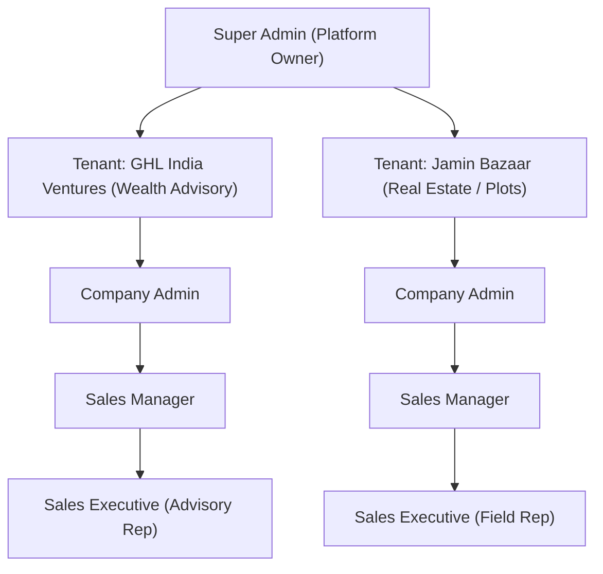
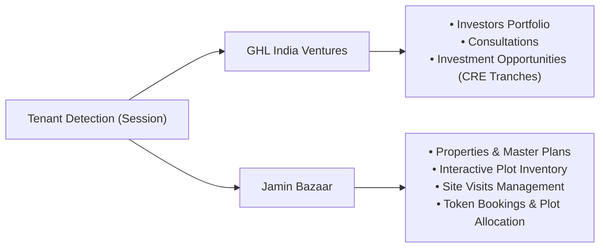
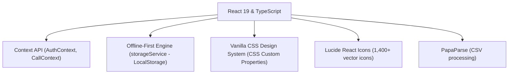

# NexusSales Frontend — Architecture, Functional Specification & User Guide

**Application:** NexusSales Multi-Tenant CRM & Telephony Cockpit  
**Target Focus:** Frontend Architecture, User Personas, Feature Breakdown & Operational Workflows  
**Stack:** React 19, TypeScript, Vite 8, Vanilla CSS (Custom Design System), Lucide React  
**Date:** September 2026  

---

## 1. Executive Summary

**NexusSales** is an enterprise-grade, multi-tenant **Sales Engagement, CRM, and Telephony Cockpit** built as a high-performance Single-Page Application (SPA). 

It bridges the gap between sales management and active voice communication by combining:
1. **Full-Cycle CRM Pipelines** (Leads, Deals, Customer 360, Interactive Kanban).
2. **Embedded Telephony Engine** (Click-to-Call, In-Call Floating Bar, Video Preview, Call Recordings, Waveforms, and AI Transcription).
3. **Tenant-Specific Business Specializations** (Plotted Real Estate & Farmland vs. Institutional Wealth & Investment Advisory).
4. **Multi-Role Scoping & Access Governance** (Super Admin, Company Admin, Sales Manager, Sales Executive).

The frontend operates in an **offline-first, zero-backend-dependency demo mode** via its built-in `storageService` (LocalStorage engine with full relational mock data), while also supporting live REST API communication with JWT-based Bearer authentication.

---

## 2. Why is NexusSales Used? (Business Problems & Value Proposition)

| Traditional Problem | NexusSales Solution |
|---|---|
| **Fragmented Software Stack**: Reps juggle between a CRM, a third-party softphone/dialer, Excel sheets, and video conferencing apps. | **Unified Single-Screen Cockpit**: Reps can click-to-call any record directly, reference dynamic talking points, take live notes, preview video, and log dispositions without switching browser tabs. |
| **Rigid One-Size-Fits-All CRMs**: Real estate developers need plot layouts and site visits, whereas investment funds need investor AUM, tranches, and wealth consultations. | **Dynamic Multi-Tenant Specialization**: The frontend detects the active tenant and instantly adapts its sidebar, dashboards, forms, fields, and terminology to match the industry. |
| **Disconnected Customer Context**: Call logs, follow-ups, deals, and KYC documents live in separate siloes. | **Customer 360 Cockpit**: A comprehensive view providing commercial value, audio recordings with interactive waveforms, follow-up calendars, deal milestones, and document storage. |
| **Sales Rep Lead Stealing & Leakage**: Junior reps seeing competitors' or senior reps' accounts. | **Role-Based Data Scoping**: Sales Executives are strictly scoped to their assigned records; Managers and Admins view company-wide aggregated pipelines. |

---

## 3. Who Uses It? (User Personas & Role Matrix)



### 3.1 Super Admin (Platform Operator)
- **Who they are:** Nexus platform operators / SaaS owners.
- **Key Responsibilities:**
  - Onboard and provision new enterprise company accounts.
  - Enable/disable functional feature flags per tenant package.
  - Oversee global telephony routing gateways and system audit logs.

### 3.2 Company Admin
- **Who they are:** Chief Sales Officers (CSO) or Operations Directors.
- **Key Responsibilities:**
  - Manage employee directory, invite reps, and assign roles.
  - Configure company branding (logo, theme color, taglines, business hours, lead SLA timers).
  - Inspect company-wide audit trails and enforce compliance.

### 3.3 Sales Manager
- **Who they are:** Team Leads managing squads of telecallers and field executives.
- **Key Responsibilities:**
  - Oversee team pipeline health and conversion bottlenecks on the Kanban board.
  - Assign and re-route inbound lead queues to reps based on availability.
  - Listen to call recordings, evaluate AI transcriptions, and review performance reports.

### 3.4 Sales Executive (Field Rep / Telecaller)
- **Who they are:** Frontline sales professionals executing daily outreach.
- **Key Responsibilities:**
  - Work through assigned lead queues with click-to-call dialing.
  - Log call dispositions, tag outcomes, and schedule automatic follow-up tasks.
  - Coordinate site visits (for land) or advisory consultations (for wealth).
  - Move deals across stages and upload KYC/legal documents in Customer 360.

---

## 4. Multi-Tenant Specialization

The frontend identifies the tenant during authentication and dynamically activates specific navigation tabs, data schemas, and workflows:



### Comparative Analysis:

| Dimension | **GHL India Ventures** | **Jamin Bazaar** |
|---|---|---|
| **Industry** | Institutional Wealth & Commercial Real Estate Advisory | Plotted Developments, Farmlands & Gated Enclaves |
| **Primary Theme Color** | Blue / Corporate Navy (`#0284c7`) | Crimson / Forest Green (`#e10600`) |
| **Currency & Format** | `₹ INR` with Lakhs / Crores (`₹1.5 Cr`, `₹80 L`) | `₹ INR` with Lakhs / Crores (`₹45 L`, `₹1.2 Cr`) |
| **Primary Deal Unit** | Investment Tranches & High-Yield Commitments | Plotted Units, Square Yardage & Survey Numbers |
| **Specialized Modules** | 1. **Investors** (Institutional & Family Office profiles)<br/>2. **Consultations** (Private wealth advisory sessions)<br/>3. **Investment Opportunities** (Target yields, funding deadlines) | 1. **Properties** (Master layout blueprints)<br/>2. **Plots** (Interactive status grid, dimensions, facing)<br/>3. **Site Visits** (Cab booking, driver, tour completion)<br/>4. **Bookings** (Token payments, allotment letters) |

---

## 5. Exhaustive Page-by-Page Feature Breakdown

### 5.1 Core CRM & Engagement Modules

#### 1. Dashboard (`/dashboard`)
- **Metric Cards:** Total Revenue, Pipeline Value, Active Leads, Calls Made, Conversion Rate.
- **Role-Scoped Analytics:** Executives see personal targets; Managers and Admins see aggregated company statistics.
- **Activity Stream & Quick Call:** Feed of recent system events and one-click dialer triggers for immediate follow-up.

#### 2. Leads Management (`/leads`)
- **Multi-Condition Filter Bar:** Filter by Lead Status (`New`, `Contacted`, `Qualified`, `Proposal`, `Negotiation`, `Converted`, `Lost`), Priority, Source, and Assigned Agent.
- **Bulk CSV Operations:** CSV Import with column mapping and Export powered by `PapaParse`.
- **Slide-out Lead Drawer:** Comprehensive slide-out panel containing lead timeline, lead score, notes, and the direct "Convert to Customer" workflow.

#### 3. Customer 360 Cockpit (`/customers`)
- **Split-View Architecture:**
  - **Left Directory Panel (380px):** Customer list, search input, status filters (`Active`, `VIP`, `Inactive`), agent filters, and "New Customer" creation modal.
  - **Right 360 Cockpit Panel:** Tabbed relationship view:
    - **Overview:** Commercial profile, total committed revenue, tenant-specific relationship attributes.
    - **Calls:** Complete call log with direct audio playback and AI speech transcriptions.
    - **Follow-ups:** Scheduled appointments and overdue tasks.
    - **Deals:** Associated high-value contracts and deal stages.
    - **Activity Timeline:** Chronological timeline merging calls, status changes, and notes.
    - **Documents:** KYC repository with uploader and download links.

#### 4. Pipeline & Deals (`/pipeline` & `/deals`)
- **Pipeline (Interactive Kanban):** Drag-and-drop opportunity cards across customized stages:
  - *New Lead -> Contacted -> Qualified -> Site Visit/Consultation -> Proposal -> Negotiation -> Won / Lost*.
- **Deals Table:** Tabular view showing expected close dates, deal values, probability weights, and stage chips.

#### 5. Follow-ups Management (`/followups`)
- Calendar and list views for daily callback schedules.
- Priority indicators (`Urgent`, `High`, `Medium`, `Low`).
- One-click completion and automatic rescheduling.

---

### 5.2 Embedded Telephony & Call Center Module

#### 6. Call Center Workspace (`/call-center`)
- **Digital Keypad (DTMF):** Manual number dialing with digit audio tones.
- **Lead Queue Navigator:** Allows telecallers to power-dial through lead lists consecutively.
- **Dynamic Objection-Handling Scripts:** On-screen talking points tailored to the selected lead profile.
- **Live Audio Waveform:** Real-time visual feedback of voice activity.

#### 7. Global In-Call Surface (Persistent Across All Pages)
- **Floating In-Call Bar:** Remains visible at the bottom of the screen regardless of page navigation:
  - Elapsed call timer.
  - Mute / Unmute microphone toggle.
  - Call Hold toggle.
  - Quick note input field.
  - **Live Camera Preview:** Uses `navigator.mediaDevices.getUserMedia` for video meetings.
  - **Google Meet Integration:** One-click launch of Google Meet video sessions.
  - **Post-Call Disposition Modal:** Triggered on call termination to categorize outcomes (`Connected`, `Busy`, `Left Voicemail`, `Follow-up Required`) and automatically schedule the next task.

#### 8. Call History & Recordings (`/call-history`)
- Complete audit of all calls with directional indicators (inbound/outbound).
- Embedded HTML5 audio player for recorded sessions.
- Expandable AI speech-to-text transcriptions with speaker tagging.

---

### 5.3 Tenant-Specific Operational Pages

#### Jamin Bazaar (Plotted Real Estate):
1. **Properties (`/properties`):** Layouts, master plans, acreage, RERA numbers, and project specifications.
2. **Plots Inventory (`/plots`):** Interactive plot grid visualizer:
   - Color codes: **Green** (Available), **Yellow** (Blocked/Token), **Red** (Booked/Sold).
   - Filter by facing (North/East/West/South), dimensions (30x40, 40x60), and sq.ft rate.
3. **Site Visits (`/site-visits`):** Manages physical tours, driver details, cab pickup times, and visit completion feedback.
4. **Bookings (`/bookings`):** Converts qualified visits into plot token bookings, tracking advance payments and allotment letters.

#### GHL India Ventures (Wealth & Institutional Advisory):
1. **Investors (`/investors`):** Ultra-HNI and Institutional profiles, tracking committed AUM, investment mandates, and risk tolerances.
2. **Consultations (`/consultations`):** 1-on-1 advisory session scheduler with wealth strategists.
3. **Investment Opportunities (`/investment-opportunities`):** Commercial real estate tranches, minimum ticket sizes, and target yields.

---

### 5.4 Administration & Governance Pages

1. **Company Users (`/company/users`):** Manage team members, toggle active/disabled states, assign roles, and allocate routing queues.
2. **Company Settings (`/company/settings`):** Manage branding colors, logos, timezones, currency, and lead SLA thresholds.
3. **Audit Trail (`/company/audit`):** Tamper-evident ledger recording all actions (logins, exports, record deletions, deal stage changes).
4. **Super Admin Platform Console (`/admin/*`):** Platform-level health dashboard, multi-tenant company creation, global role permissions, and telephony gateway configuration.

---

## 6. End-to-End User Journey: How They Use It

```mermaid
sequenceDiagram
    autonumber
    actor Rep as Sales Executive
    participant TopBar as Quick Actions & TopBar
    participant Dialer as Embedded Telephony
    participant Leads as Leads & Pipeline
    participant C360 as Customer 360
    
    Rep->>TopBar: Switches Persona / Logs in
    Rep->>Leads: Reviews assigned lead queue
    Rep->>Dialer: Clicks "Click-to-Call" on a lead
    Note over Dialer: Call bar pops up at bottom of screen with live timer
    Dialer->>Rep: Connects call; Rep views objection-handling script
    Rep->>Dialer: Ends call; Disposition modal opens
    Rep->>Dialer: Selects "Connected" & schedules Site Visit / Follow-up
    Rep->>Leads: Clicks "Convert to Customer"
    Leads->>C360: Account is created and populated with full call & deal history
    Rep->>C360: Uploads KYC documents and adds commercial deal
```

---

## 7. Frontend Technology Stack & Design System



1. **Core Framework:** React 19 + TypeScript with strict typing across all interfaces (`Customer`, `Lead`, `Deal`, `CallRecord`, `Tenant`, `Role`).
2. **Build System:** Vite 8 (sub-second HMR, production builds in < 600ms).
3. **Styling Philosophy:** Pure Vanilla CSS custom properties (`var(--primary-600)`, `var(--bg-surface)`, glassmorphism effects, responsive flex/grid layouts) with zero external CSS framework overhead.
4. **Offline Resilience:** `storageService.ts` pre-seeds and synchronizes all relational CRM tables in the browser’s `localStorage`.
5. **Telephony Simulation:** Emulates WebRTC media streaming, DTMF dial tones, audio player waveforms, and video preview streams natively in browser memory.
