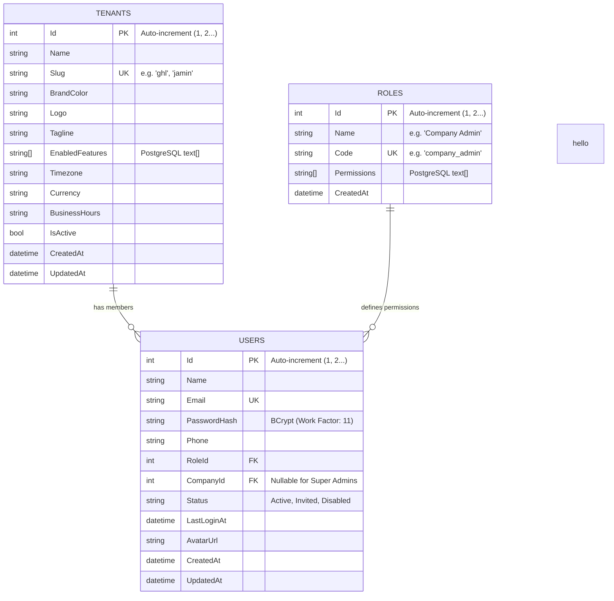

# NexusSales Backend - Authentication & Architecture Documentation

**Platform:** NexusSales Multi-Tenant CRM  
**Module:** Authentication & Multi-Tenancy Core  
**Stack:** ASP.NET Core 8 Web API, Entity Framework Core 8, PostgreSQL, JWT Bearer Auth, FluentValidation  
**Author / Team:** Sales Rep App Engineering Team  
**Date:** September 2026  

---

## 1. Executive Summary

This document provides a comprehensive technical overview of the **Authentication and Tenant Core Backend** implemented for the **NexusSales** platform. 

The backend has been developed from scratch as a modular, production-ready ASP.NET Core 8 Web API, strictly adhering to the frontend data contracts and business requirements. It manages:
- Multi-tenant data segregation with integer-based primary/foreign keys (`1, 2, 3...`)
- Secure password hashing using **BCrypt**
- Asymmetric/Signed **JWT Bearer token** issuance containing role and tenant claims
- Input validation using **FluentValidation**
- Centralized exception handling and standardized API response formats (`ApiResponse<T>`)
- Seamless full-stack integration with the existing React + TypeScript frontend

---

## 2. Architecture & Project Structure

The project follows Clean Architecture / Layered Design patterns within a single maintainable ASP.NET Core project:

```
sales_rep_app/
├── backend/
│   ├── Authentication/
│   │   ├── Interfaces/
│   │   │   └── IJwtService.cs               # JWT issuance contract
│   │   └── Implementations/
│   │       └── JwtService.cs                # Token generation with claims
│   ├── Configuration/
│   │   └── JwtSettings.cs                   # Strongly typed JWT options
│   ├── Controllers/
│   │   └── AuthController.cs                # HTTP endpoints (POST /api/auth/login)
│   ├── Data/
│   │   ├── ApplicationDbContext.cs          # EF Core DbContext & Seed Data
│   │   └── Configurations/
│   │       ├── RoleConfiguration.cs         # Fluent API mapping for Roles
│   │       ├── TenantConfiguration.cs       # Fluent API mapping for Tenants
│   │       └── UserConfiguration.cs         # Fluent API mapping for Users
│   ├── DTOs/
│   │   ├── Auth/
│   │   │   ├── LoginRequestDto.cs           # Email and Password request payload
│   │   │   ├── LoginResponseDto.cs          # Token, User, and Tenant response
│   │   │   ├── RoleDto.cs                   # Role information & permissions
│   │   │   ├── TenantDto.cs                 # Tenant branding & feature flags
│   │   │   └── UserDto.cs                   # User profile representation
│   │   └── Common/
│   │       └── ApiResponse.cs               # Generic standardized envelope
│   ├── Extensions/
│   │   ├── AuthenticationExtensions.cs      # AddJwtAuthentication configuration
│   │   └── ServiceExtensions.cs             # DI container registrations & Swagger
│   ├── Helpers/
│   │   └── PasswordHasher.cs                # BCrypt hashing & constant-time verify
│   ├── Middleware/
│   │   └── ExceptionHandlingMiddleware.cs   # Global unhandled exception handler
│   ├── Migrations/                          # EF Core Code-First Migrations
│   ├── Models/
│   │   ├── Entities/
│   │   │   ├── Role.cs                      # Role entity
│   │   │   ├── Tenant.cs                    # Tenant / Organization entity
│   │   │   └── User.cs                      # Application user entity
│   │   └── Enums/
│   │       └── UserStatus.cs                # Active, Invited, Disabled
│   ├── Repositories/
│   │   ├── Interfaces/
│   │   │   └── IUserRepository.cs           # User database queries
│   │   └── Implementations/
│   │       └── UserRepository.cs            # EF Core query implementation
│   ├── Services/
│   │   ├── Interfaces/
│   │   │   └── IAuthService.cs              # Authentication logic contract
│   │   └── Implementations/
│   │       └── AuthService.cs               # Login orchestration & validation
│   ├── Validators/
│   │   └── Auth/
│   │       └── LoginRequestValidator.cs     # FluentValidation rules
│   ├── appsettings.json                     # Environment configuration & ConnectionStrings
│   └── Program.cs                           # App startup, middleware pipeline & CORS
└── frontend/                                # React + TypeScript client
```

---

## 3. Database Design & Entity Relationships

The database is built on **PostgreSQL (SalesAppDB)** using EF Core Code-First migrations with PostgreSQL-native types (such as `text[]` for permissions and feature arrays).

All entities use **auto-incrementing integer IDs (`1, 2, 3...`)**:



---

## 4. Pre-Seeded Default Data

The database has been seeded with standard roles, tenants, and demo users. All demo users share the password: **`Password@123`**.

### 4.1 Roles
| ID | Name | Code | Description / Scope |
|---|---|---|---|
| `1` | Super Admin | `super_admin` | Full platform operator privileges across all tenants. |
| `2` | Company Admin | `company_admin` | Full administrative control within their specific tenant. |
| `3` | Sales Manager | `sales_manager` | Manages leads, deals, calls, and sales reps in the tenant. |
| `4` | Sales Executive | `sales_executive` | Field sales, client calling, leads, site visits, and bookings. |

### 4.2 Tenants
| ID | Slug | Name | Primary Domain / Focus |
|---|---|---|---|
| `1` | `ghl` | GHL India Ventures | Institutional Wealth & Real Estate Investment Advisory |
| `2` | `jamin` | Jamin Bazaar | Premium Plotted Enclaves & Farmland Communities |

### 4.3 Demo User Accounts
| ID | Role | Tenant | Email | Password |
|---|---|---|---|---|
| `1` | Super Admin | *Platform-wide* | `alex@nexusplatform.io` | `Password@123` |
| `2` | Company Admin | GHL India (`1`) | `vikram@ghlindiatrust.com` | `Password@123` |
| `3` | Sales Executive | GHL India (`1`) | `ananya@ghlindiatrust.com` | `Password@123` |
| `4` | Company Admin | Jamin Bazaar (`2`) | `kavita@jaminbazaar.com` | `Password@123` |

---

## 5. API Specification: Login

### Endpoint
`POST /api/auth/login`

- **Authentication:** `[AllowAnonymous]`
- **Content-Type:** `application/json`

### 5.1 Request Body
```json
{
  "email": "vikram@ghlindiatrust.com",
  "password": "Password@123"
}
```

### 5.2 Success Response (`200 OK`)
```json
{
  "success": true,
  "message": "Login successful",
  "data": {
    "token": "eyJhbGciOiJIUzI1NiIsInR5cCI6IkpXVCJ9...",
    "user": {
      "id": "2",
      "name": "Vikram Malhotra",
      "email": "vikram@ghlindiatrust.com",
      "phone": "+91 98450 11223",
      "role": {
        "id": "2",
        "name": "Company Admin",
        "code": "company_admin",
        "permissions": [
          "leads.view", "leads.create", "leads.update", "leads.delete",
          "customers.view", "customers.create", "deals.view", "..."
        ]
      },
      "companyId": "1",
      "companySlug": "ghl",
      "companyName": "GHL India Ventures",
      "status": "Active",
      "lastLogin": "Just now",
      "avatar": null
    },
    "tenant": {
      "id": "1",
      "name": "GHL India Ventures",
      "slug": "ghl",
      "brandColor": "#0284c7",
      "tagline": "Institutional Wealth & Real Estate Investment Advisory",
      "enabledFeatures": [
        "leads", "customers", "deals", "followups", "calls",
        "call-recording", "call-transcription", "investors", "..."
      ],
      "timezone": "Asia/Kolkata (IST)",
      "currency": "₹ INR",
      "businessHours": "09:30 AM - 07:00 PM IST"
    }
  },
  "errors": []
}
```

### 5.3 Error Responses

#### `401 Unauthorized` (Invalid Credentials / Non-existent User)
Prevents account enumeration by returning the exact same generic error message regardless of whether the email or password was incorrect:
```json
{
  "success": false,
  "message": "Invalid email or password.",
  "data": null,
  "errors": []
}
```

#### `400 Bad Request` (Validation Failure)
```json
{
  "type": "https://tools.ietf.org/html/rfc9110#section-15.5.1",
  "title": "One or more validation errors occurred.",
  "status": 400,
  "errors": {
    "Email": ["A valid email address is required."],
    "Password": ["Password is required."]
  }
}
```

---

## 6. Security & Architectural Best Practices

1. **Password Security**:
   - Uses `BCrypt.Net-Next` with a work factor of 11.
   - Salt is automatically managed and embedded within the hash string.
   - Password hashes are never returned in DTO responses.

2. **JWT Claims Architecture**:
   - Issued tokens contain standard and custom claims:
     - `sub`: User ID (`int.ToString()`)
     - `name`: User Full Name
     - `email`: User Email
     - `role`: Role Code (`company_admin`, `sales_executive`, etc.)
     - `company_id`: Tenant ID
     - `company_slug`: Tenant Slug (`ghl`, `jamin`)
     - `jti`: Unique token GUID for token tracking
   - Tokens are validated via `AddJwtBearer` middleware with issuer, audience, and secret key checks.

3. **CORS Policy**:
   - Configured specifically to allow the React development client (`http://localhost:5173`) with headers, credentials, and methods enabled.

4. **Global Exception Handling**:
   - `ExceptionHandlingMiddleware` catches all unhandled server exceptions, logs the details, and returns a clean, safe `500 Internal Server Error` response without exposing raw database connection strings or stack traces.

---

## 7. How to Run Locally

### Prerequisites
- [.NET 8.0 SDK](https://dotnet.microsoft.com/download/dotnet/8.0)
- [PostgreSQL](https://www.postgresql.org/) running on `localhost:5432`

### Backend Setup
1. Navigate to the backend directory:
   ```bash
   cd sales_rep_app/backend
   ```
2. Verify `appsettings.json` connection string:
   ```json
   "ConnectionStrings": {
     "DefaultConnection": "Host=127.0.0.1;Port=5432;Database=SalesAppDB;Username=postgres;Password=YOUR_PASSWORD"
   }
   ```
3. Apply migrations to initialize and seed PostgreSQL:
   ```bash
   dotnet ef database update
   ```
4. Run the API:
   ```bash
   dotnet run --launch-profile http
   ```
5. Access Swagger UI:
   - URL: **`http://localhost:5106/swagger`**

### Frontend Integration
1. Navigate to the frontend directory:
   ```bash
   cd sales_rep_app/frontend
   ```
2. Verify `.env`:
   ```env
   VITE_API_URL=http://localhost:5106/api
   ```
3. Run the development server:
   ```bash
   npm run dev
   ```
4. Access the app: **`http://localhost:5173`**
   - Log in using `vikram@ghlindiatrust.com` / `Password@123`.
